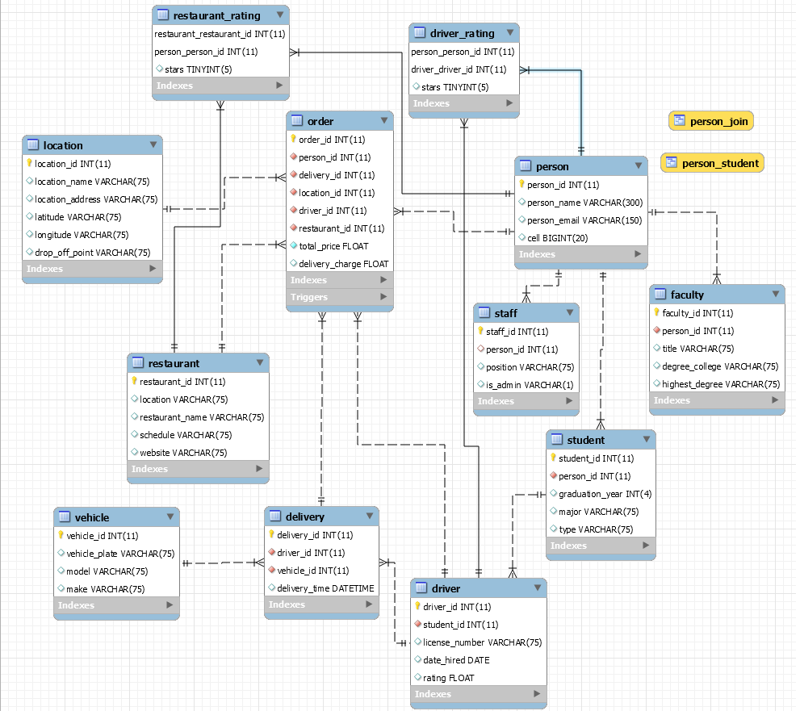

# Campus-Eats-DB-Project <!-- omit in toc -->

Final project for ITCS 3160 at UNCC for David Benton, Andrew Quinn, Chris Donohue, Matthew Lewis, Hari Dhimal

## Table of Contents <!-- omit in toc -->

- [Introduction](#introduction)
- [Use Case for Rating System](#use-case-for-rating-system)
- [EERD](#eerd)
- [MySQL Queries](#mysql-queries)
- [Stored Procedures](#stored-procedures)
- [Web/App Implementation or Description of Future Work](#webapp-implementation-or-description-of-future-work)
- [MySQL dump](#mysql-dump)
- [PPT Video](#ppt-video)

## Introduction

## Use Case for Rating System

## EERD

## MySQL Queries

## Stored Procedures

## Web/App Implementation or Description of Future Work

## MySQL dump

## PPT Video
